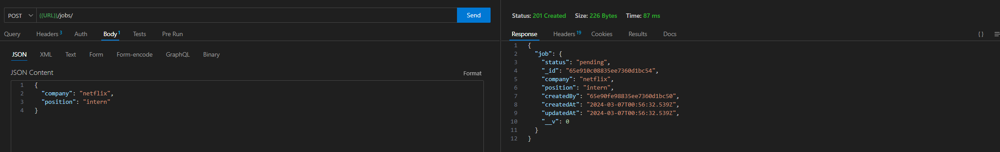

# Jobs API

An API where a user can register, login, and add jobs they have applied for.

## Tools Used

- Implemented with JavaScript
- Node.js for backend
- Express.js to create an API with CRUD operations
- JSON Web Token for authentication

## Images

